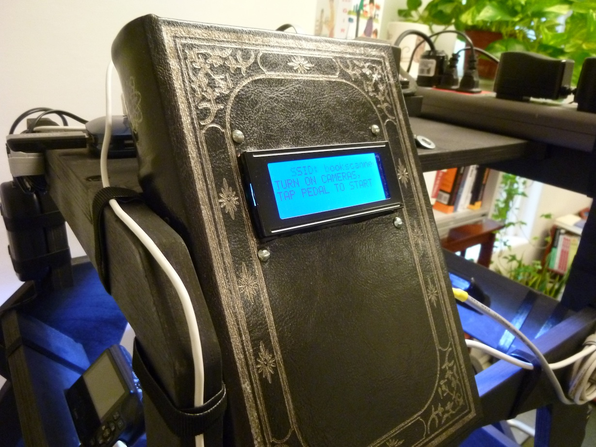

diy-bookscanner
===============
This repo contains, at the moment, the main script and LCD module for running a [DIY bookscanner](http://www.diybookscanner.org/) using a Raspberry Pi.  The script, bookscanner.py, is derived from Mark Van den Borre's [test_keypedal.sh](https://github.com/markvdb/diybookscanner/blob/master/misc/test_keypedal.sh).  Per correspondence with Mark, this code is released under the AGPL.

The user interface for this system consists of a 20x4 LCD screen for output and a foot switch for input.  The Raspberry Pi talks to both devices using [RPi.GPIO](https://pypi.python.org/pypi/RPi.GPIO).  The code in lcd.py is largely derived from that in [Matt Hawkins' article "20×4 LCD Module Control Using Python"](http://www.raspberrypi-spy.co.uk/2012/08/20x4-lcd-module-control-using-python/).

